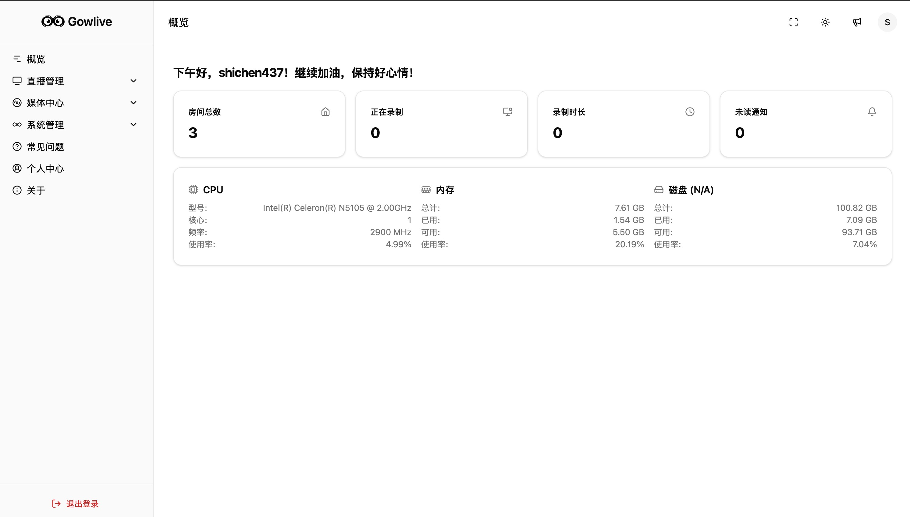
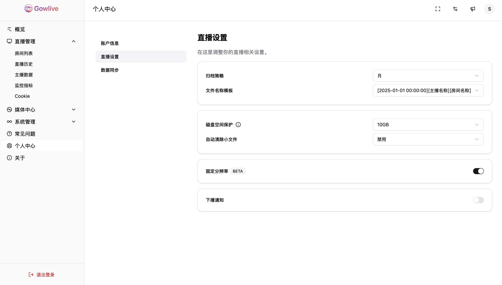
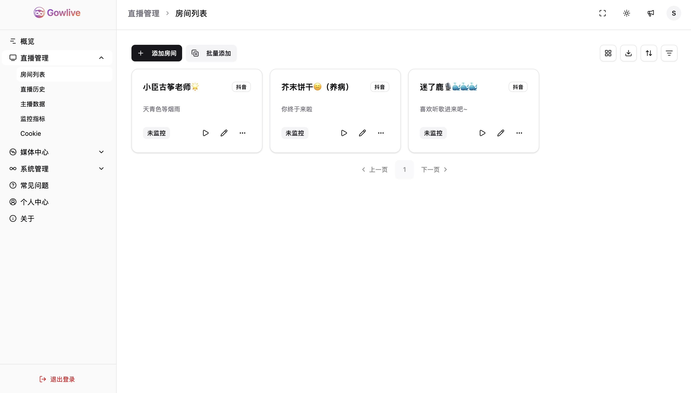
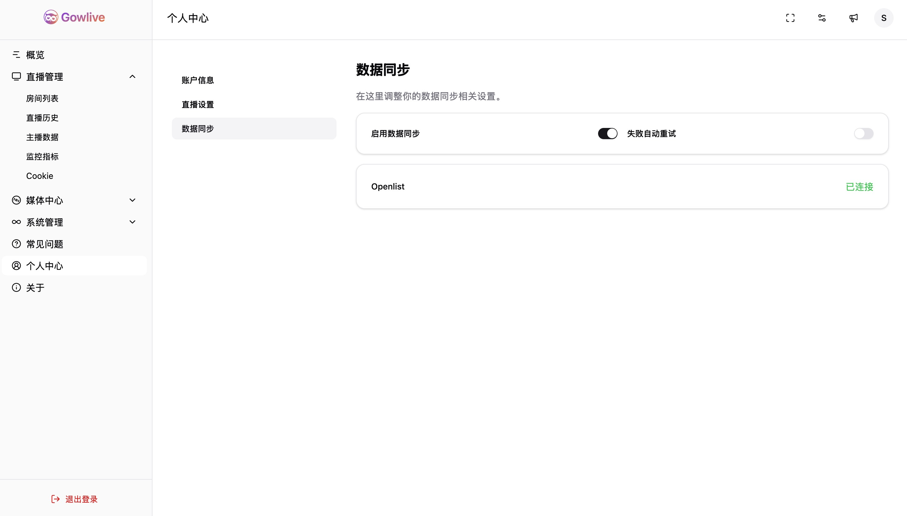

<div align="center">
  
  <h1>Gowlive</h1>
  <p><a href="./CHANGELOG.md">更新日志</a> | <a href="./README_EN.md">English</a></p>
  <p>
    <strong>一个基于 GoFrame 和 Vue3 构建的直播录制平台</strong>
  </p>
  <p>
  <a>
    
  </a>
  <a>
    
  </a>
  <a href="https://hub.docker.com/u/shichen437" target="_blank">
    
  </a>
  <a>
    
  </a>
  <a href="https://t.me/+ApCMUBMvNa1lNGM1">
    
  </a>
</p>
</div>

## ✨ 项目简介

Gowlive 是一个基于 [GoFrame](https://goframe.org/) 和 [Vue3](https://vuejs.org/) 构建的直播录制平台，支持 Docker 一键部署。你可以用它来录制你喜欢的直播内容，方便随时回顾。

_本项目仅用于学习和技术交流，请勿用于商业用途。不涉及任何（包括存储、上传、爬取等）私人信息。_

## 🚀 功能特性

- 🔴 **直播录制**: 支持实时录制/定时录制/智能录制任务。
- 🕒 **直播历史**: 录制直播时记录直播历史。
- 📽️ **视频剪辑**: 支持对录制视频进行快速剪辑。
- 🫥 **主播数据**: 记录主播基本信息并自动更新，展示统计图表。
- 🍪 **Cookie管理**: 方便地管理不同平台的登录Cookie。
- 📁 **文件管理**: 管理录制下来的视频文件。
- ☑️ **文件检测**: 检测视频文件是否损坏。
- 🔄 **文件同步**: 基于 openlist 实现文件同步。
- 📜 **日志中心**: 记录系统运行日志，方便排查问题。
- 📢 **推送渠道**: 支持通过 Gotify、邮件等多种渠道推送消息。
- 🔔 **通知中心**: 集中查看和管理所有通知。
- 💾 **空间预警**: 存储空间达到阈值时发送预警。
- 🌙 **深色模式**: 支持深色模式。

## 📺 支持平台

- 抖音
- 哔哩哔哩
- YY直播
- Bigo Live

## 📸 预览

<div align="center">
  
</div>

<br>

<div align="center">
  &nbsp;&nbsp;
  
</div>
<div align="center">
  &nbsp;&nbsp;
  
</div>

## 📦 部署

> 初始账号密码：`admin` / `gowlive`

### Docker 镜像部署

1.  拉取镜像:

    ```bash
    docker pull shichen437/gowlive:latest
    ```

2.  运行容器:

    ```bash
    docker run -d \
      -p 12580:12580 \
      -v /data/gowlive:/gowlive/resources/data \
      -e PROJECT_SM4KEY=abcdefghijklmnopqrstuvwxyz123456 \
      -e TZ=Asia/Shanghai \
      --name gowlive \
      --restart=always \
      shichen437/gowlive:latest
    ```

    > **Note:** `-v /data/gowlive:/gowlive/resources/data` 用于持久化存储录播文件和应用数据，请将 `/data/gowlive` 替换为你本地的实际路径。

3.  访问 `http://<YOUR_IP>:12580` 查看应用。

### Docker Compose 部署

1.  下载 `docker-compose.yaml.example` 文件并重命名:
    ```bash
    wget https://raw.githubusercontent.com/shichen437/Gowlive/main/docker-compose.yaml.example -O docker-compose.yaml
    ```
2.  根据需要修改 `docker-compose.yaml` 文件。

    **环境变量:**

| 变量名              | 变量描述                  | 默认值                             | 是否必填 |
| :------------------ | :------------------------ | :--------------------------------- | :------- |
| `PROJECT_SM4KEY`    | SM4 加密密钥 (32位字符串) | `abcdefghijklmnopqrstuvwxyz123456` | 是       |
| `TZ`                | 时区                      | `Asia/Shanghai`                    | 否       |
| `PROJECT_LANG`      | 语言                      | `zh-CN` (`en`, `zh-TW`)            | 否       |
| `OPENLIST_DOMAIN`   | openlist域名              | http://192.168.1.1:5444            | 否       |
| `OPENLIST_USERNAME` | openlist用户名            |                                    | 否       |
| `OPENLIST_PASSWORD` | openlist密码              |                                    | 否       |
| `OPENLIST_CODE`     | openlist 2FA code         |                                    | 否       |

3.  启动服务:
    ```bash
    docker-compose up -d
    ```
4.  访问 `http://<YOUR_IP>:12580` 查看应用。

## 🤝 感谢贡献

衷心感谢每位贡献者对 Gowlive 的支持与付出，致以诚挚的敬意。(<a href="./.github/docs/CONTRIBUTING.md">贡献指南</a>)

<a href="https://github.com/shichen437/Gowlive/graphs/contributors">
  
</a>

## 📄 开源协议

本项目基于 [MIT License](https://github.com/shichen437/Gowlive/blob/main/LICENSE) 开源。
