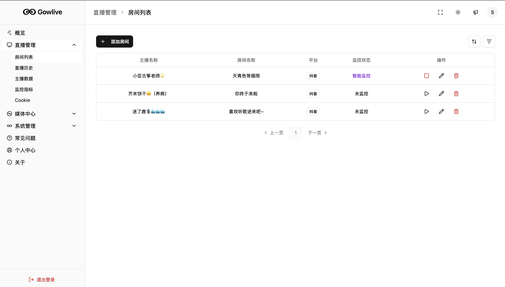

<div align="center">
  
  <h1>Gowlive</h1>
  <p>
    <strong>一个基于 GoFrame 和 Vue3 构建的直播录制平台</strong>
  </p>
  <p>
  <a>
    
  </a>
  <a href="https://hub.docker.com/u/shichen437" target="_blank">
    
  </a>
  <a>
    
  </a>
</p>
</div>

## ✨ 项目简介

Gowlive 是一个基于 [GoFrame](https://goframe.org/) 和 [Vue3](https://vuejs.org/) 构建的直播录制平台，支持 Docker 一键部署。你可以用它来录制你喜欢的直播内容，方便随时回顾。

*本项目仅用于学习和技术交流，请勿用于商业用途。不涉及任何（包括存储、上传、爬取等）私人信息。*

## 🚀 功能特性

-   🔴 **直播录制**: 支持实时录制和定时录制任务。
-   🕒 **直播历史**: 录制直播时记录直播历史。
-   🍪 **Cookie管理**: 方便地管理不同平台的登录Cookie。
-   📁 **文件管理**: 在线管理录制下来的视频文件。
-   📜 **日志中心**: 记录系统运行日志，方便排查问题。
-   📢 **推送渠道**: 支持通过 Gotify、邮件等多种渠道推送消息。
-   🔔 **通知中心**: 集中查看和管理所有通知。
-   💾 **空间预警**: 存储空间达到阈值时发送预警。

## 📺 支持平台

-   抖音
-   Bilibili

## 📸 预览

<div align="center">
  
</div>

<br>

<div align="center">
  &nbsp;&nbsp;
  
</div>

## 📦 部署

> 初始账号密码：`admin` / `gowlive`

### Docker 镜像部署

1.  拉取镜像:
    ```bash
    docker pull shichen437/gowlive:latest
    ```
2.  运行容器:
    ```bash
    docker run -d \
      -p 12580:12580 \
      -v /data/gowlive:/gowlive/resources/data \
      -e PROJECT_SM4KEY=abcdefghijklmnopqrstuvwxyz123456 \
      -e TZ=Asia/Shanghai \
      --name gowlive \
      --restart=always \
      shichen437/gowlive:latest
    ```
    > **Note:** `-v /data/gowlive:/gowlive/resources/data` 用于持久化存储录播文件和应用数据，请将 `/data/gowlive` 替换为你本地的实际路径。

3.  访问 `http://<YOUR_IP>:12580` 查看应用。

### Docker Compose 部署

1.  下载 `docker-compose.yaml.example` 文件并重命名:
    ```bash
    wget https://raw.githubusercontent.com/shichen437/Gowlive/main/docker-compose.yaml.example -O docker-compose.yaml
    ```
2.  根据需要修改 `docker-compose.yaml` 文件。

    **环境变量:**

| 变量名 | 变量描述 | 默认值 | 是否必填 |
| :--- | :--- | :--- | :--- |
| `PROJECT_SM4KEY` | SM4 加密密钥 (32位字符串) | `abcdefghijklmnopqrstuvwxyz123456` | 是 |
| `TZ` | 时区 | `Asia/Shanghai` | 否 |

3.  启动服务:
    ```bash
    docker-compose up -d
    ```
4.  访问 `http://<YOUR_IP>:12580` 查看应用。

## 🛠️ 快速开发

### 1. 环境准备

-   [Go](https://go.dev/) (版本 >= 1.24)
-   [Node.js](https://nodejs.org/) (版本 >= 16)
-   [Yarn](https://yarnpkg.com/)

### 2. 克隆项目

```bash
git clone https://github.com/shichen437/Gowlive.git
cd Gowlive
```

### 3. 后端启动

```bash
# 复制配置文件
cp manifest/config/config.yaml.example manifest/config/config.yaml

# 安装 Go 依赖
go mod tidy

# 启动后端服务 (使用 GoFrame CLI 工具可实现热更新)
# 首次运行需要安装 CLI
make cli.install

# 启动！
gf run main.go # 冷启动使用：go run main.go
```

### 4. 前端启动

```bash
# 进入前端目录
cd web

# 安装 Node.js 依赖
npm install

# 启动前端开发服务
npm run dev # 或 yarn dev
```

## 🤝 贡献

欢迎提交 Issue 或 Pull Request，参与项目共建！

## 📄 开源协议

本项目基于 [MIT License](https://github.com/shichen437/Gowlive/blob/main/LICENSE) 开源。
