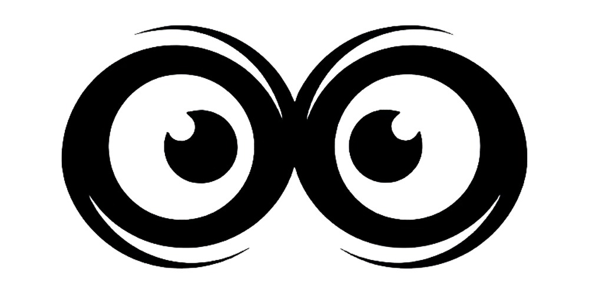

<div align="center">
  
  <h1>Gowlive</h1>
  <p><a href="./CHANGELOG.md">CHANGELOG</a> | <a href="./README.md">中文文档</a></p>
  <p>
    <strong>A live streaming recording platform built with GoFrame and Vue3</strong>
  </p>
  <p>
  <a>
    
  </a>
  <a>
    
  </a>
  <a href="https://hub.docker.com/u/shichen437" target="_blank">
    
  </a>
  <a>
    
  </a>
</p>
</div>

## ✨ Introduction

Gowlive is a live streaming recording platform built with [GoFrame](https://goframe.org/) and [Vue3](https://vuejs.org/), supporting one-click Docker deployment. You can use it to record your favorite live content for easy review.

_This project is for learning and technical exchange purposes only, not for commercial use. It does not involve any private information (including storage, uploading, crawling, etc.)._

## 🚀 Features

- 🔴 **Live Recording**: Supports real-time/timed/smart recording tasks.
- 🕒 **Live History**: Records live history during recording.
- 📽️ **Video Editing**: Supports quick editing of recorded videos.
- 🫥 **Anchor Data**: Records and automatically updates basic anchor information, displays statistical charts.
- 🍪 **Cookie Management**: Conveniently manage login Cookies from different platforms.
- 📁 **File Management**: Manage recorded video files.
- ☑️ **File Check**: Checks if video files are corrupted.
- 📜 **Log Center**: Records system operation logs for easy troubleshooting.
- 📢 **Push Channels**: Supports sending messages through various channels such as Gotify, email.
- 🔔 **Notification Center**: Centralized viewing and management of all notifications.
- 💾 **Storage Alert**: Sends alerts when storage space reaches a threshold.
- 🌙 **Dark Mode**: Supports dark mode.

## 📺 Supported Platforms

- 抖音
- 哔哩哔哩
- YY直播
- Bigo Live

## 📸 Preview

<div align="center">
  
</div>

<br>

<div align="center">
  &nbsp;&nbsp;
  
</div>
<div align="center">
  &nbsp;&nbsp;
  
</div>

## 📦 Deployment

> Initial account password: `admin` / `gowlive`

### Docker Image Deployment

1.  Pull the image:

    ```bash
    docker pull shichen437/gowlive:latest
    ```

2.  Run the container:

    ```bash
    docker run -d \
      -p 12580:12580 \
      -v /data/gowlive:/gowlive/resources/data \
      -e PROJECT_SM4KEY=abcdefghijklmnopqrstuvwxyz123456 \
      -e PROJECT_LANG=en \
      -e TZ=Asia/Shanghai \
      --name gowlive \
      --restart=always \
      shichen437/gowlive:latest
    ```

    > **Note:** `-v /data/gowlive:/gowlive/resources/data` is used for persistent storage of recorded files and application data. Please replace `/data/gowlive` with your actual local path.

3.  Visit `http://<YOUR_IP>:12580` to view the application.

### Docker Compose Deployment

1.  Download and rename the `docker-compose.yaml.example` file:
    ```bash
    wget https://raw.githubusercontent.com/shichen437/Gowlive/main/docker-compose.yaml.example -O docker-compose.yaml
    ```
2.  Modify the `docker-compose.yaml` file as needed.

    **Environment Variables:**

| Variable Name    | Description                        | Default Value                      | Required |
| :--------------- | :--------------------------------- | :--------------------------------- | :------- |
| `PROJECT_SM4KEY` | SM4 Encryption Key (32-bit string) | `abcdefghijklmnopqrstuvwxyz123456` | Yes      |
| `TZ`             | Timezone                           | `Asia/Shanghai`                    | No       |
| `PROJECT_LANG`   | Language                           | `zh-CN` (`en`, `zh-TW`)            | No       |

3.  Start the service:
    ```bash
    docker-compose up -d
    ```
4.  Visit `http://<YOUR_IP>:12580` to view the application.

## 🤝 Acknowledgements

Sincere thanks to every contributor for their support and dedication to Gowlive. Your contributions are greatly appreciated.

(<a href="./.github/docs/CONTRIBUTING_EN.md">Contributing Guide</a>)

<a href="https://github.com/shichen437/Gowlive/graphs/contributors">
  
</a>

## 📄 License

This project is open source under the [MIT License](https://github.com/shichen437/Gowlive/blob/main/LICENSE).
